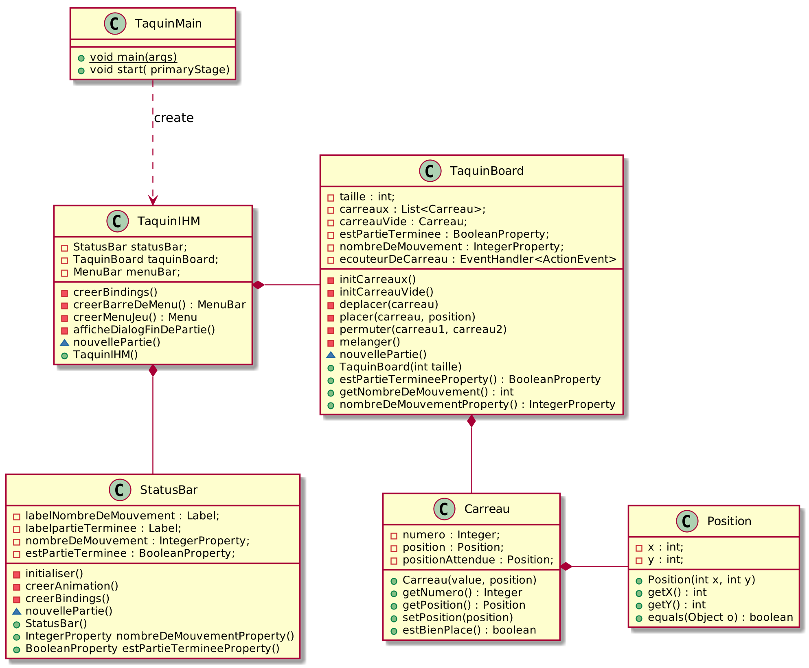
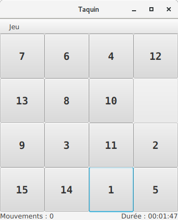

#  Introduction aux IHM en Java 

## Test d'IHM et langage Java [](https://travis-ci.com/IUTInfoAix-M2105/TestIHM2017)

**Test du vendredi 16 juin 2017 – Durée 2 heures – Documents autorisés**

L’objet de cet exercice est la programmation d’un jeu du taquin. Le taquin est un jeu solitaire en forme de damier créé 
vers 1870 aux États-Unis. Sa théorie mathématique a été publiée par l'American Journal of mathematics pure and applied 
en 1879. En 1891, son invention fut revendiquée par Sam Loyd, au moment où le jeu connaissait un engouement considérable, 
tant aux États-Unis qu'en Europe. 

Il est composé de 15 petits carreaux numérotés de 1 à 15 qui glissent dans un cadre prévu pour 16. Il consiste à 
remettre dans l'ordre les 15 carreaux à partir d'une configuration initiale quelconque. Le principe a été étendu à 
toutes sortes d'autres jeux. La plupart sont à base de blocs rectangulaires plutôt que carrés, mais le but est toujours 
de disposer les blocs d'une façon déterminée par un nombre minimal de mouvements. Le Rubik's Cube est aujourd'hui 
considéré comme l'un des « descendants » du taquin.

L'image ci-dessous, illustre un jeu du taquin résolu :


### Travail à réalisercarreaux
Votre travail dans la suite de ce sujet sera d'écrire pas à pas plusieurs classes importantes :
- Un objet `TaquinMain` est une application JavaFX permettant de jouer au Taquin.
- Un objet `TaquinIHM` est une scène de jeu avec laquelle les joueurs interagiront pour faire une partie à tour de rôle.
- Un objet `TaquinBoard` représente le plateau de jeu composé des 16 cases.
- Un objet `Carreau` représente un carreau du taquin.
- Un objet `StatusBar` permet d'afficher le score et l'état de la partie.

Le diagramme UML suivant donne un apperçu synthétique de la structure des classes de l'application :


Il y aura aussi plusieurs classes de moindre importance qui serviront d'outils pour les classes principales.

L'objectif de ce test est d'évaluer votre capacité à écrire une IHM à l'aide du langage Java, les méthodes complexes 
car trop algorithmiques n'auront pas à être implémentées. Vous pourrez retrouver une proposition de correction à l'adresse 
suivante : https://github.com/IUTInfoAix-m2105/TestIHM2017/

Le résultat attendu devra ressembler à la fenêtre suivante :



### Implémentation de la classe `Carreau`

Le plateau de jeu du taquin sera composé de 16 cases, chacune contenant un carreau placé au départ sur une case au hasard, sauf la case vide.
Chaque carreau est numéroté de 1 à 15, numéro de sa position voulue dans le plateau pour résoudre le jeu.

1. Écrivez la classe `Carreau` qui sera publique et étendra `Button`. Elle possèdera les données membres privées suivantes :
     - `value` de type `Integer` qui correspond au numéro du carreau. 
     - `position` de type `Position`, la position courante dans le plateau.
     - `positionVoulue` de type `Position`, la position finale voulue pour résoudre le jeu.

2. Écrivez un constructeur publique `Carreau(Integer numero, Position position)` qui : 
    - assigne les données membres locales correspondantes aux paramètres donnés.
    - fixe la largeur et hauteur du `Carreau` à `TaquinBoard.CELL_SIZE`, soit la taille d'une cellule. On pourra pour cela utiliser les méthodes de `Button` `setMinSize()`, `setMaxSize()` et `setPrefSize()`.
    - fixe l'alignement du contenu du carreau au centre.
    - fixe comme texte du bouton le numéro du carreau courant.

3. Écrivez les accesseurs publiques `getNumero()` et `getPosition()` qui renvoie leur donnée membre correspondante.

4. Écrivez le modifieur `setPosition(Position position)` qui assigne la donnée membre correspondante.

5. Écrivez la méthode `estBienPlace()` qui retourne vrai si le carreau est positionné à sa position finale voulue.


### Implémentation de la classe `TaquinBoard`

### Implémentation de la classe `StatusBar`
La classe `StatusBar` est un composant graphique permettant d'afficher l'état de la partie en cours. 
L'implémentation de cette classe vous est donnée ci-dessous :
```java
public class StatusBar extends BorderPane {
    private Label labelNombreDeMouvement = new Label();
    private Label labelTemps = new Label();
    private Label labelpartieTerminee = new Label();

    private IntegerProperty nombreDeMouvement = new SimpleIntegerProperty();
    private BooleanProperty estPartieTerminee = new SimpleBooleanProperty();

    private LocalTime time = LocalTime.now();
    private Timeline timer;
    private  StringProperty clock = new SimpleStringProperty("00:00:00");
    private  DateTimeFormatter fmt = DateTimeFormatter.ofPattern("HH:mm:ss").withZone(ZoneId.systemDefault());

    public StatusBar() {
        initialiser();

        creerAnimation();
        creerBindings();

        setLeft(labelNombreDeMouvement);
        setRight(labelTemps);
        setCenter(labelpartieTerminee);
    }

    private void initialiser() {
    }

    private void creerAnimation() {
        timer = new Timeline(new KeyFrame(Duration.ZERO, e-> clock.set(LocalTime.now().minusNanos(time.toNanoOfDay()).format(fmt))),
                new KeyFrame(Duration.seconds(1)));
        timer.setCycleCount(Animation.INDEFINITE);
    }

    private void creerBindings(){
        labelTemps.textProperty().bind(Bindings.concat("Durée : ",clock));
        labelNombreDeMouvement.textProperty().bind(Bindings.concat("Mouvements : ",nombreDeMouvement));
        labelpartieTerminee.textProperty().bind(when(estPartieTerminee).then("Partie terminée !").otherwise(""));
    }

    void nouvellePartie(){
        time = LocalTime.now();
        timer.playFromStart();
    }

    public IntegerProperty nombreDeMouvementProperty() {
        return nombreDeMouvement;
    }

    public BooleanProperty estPartieTermineeProperty() {
        return estPartieTerminee;
    }
}
```

### Implémentation de la classe `TaquinIHM`
La classe `TaquinIHM` représente le contenu de la fenêtre principale du Jeu (le noeud racine de la scène). En plus du 
plateau situé au centre, cette fenêtre contient une barre de menu en haut et une barre de statut en bas. La barre de menu 
contient un menu "Jeu" constitué d'une entrée "Nouvelle Partie" et d'une entrée "Quitter".

1. Écrire la déclaration d’une classe `TaquinIHM`, sous-classe de `BorderPane`, réduite, pour commencer, à 
ses variables d’instance, toutes privées :
    - `taille` de type `int` représente la taille du plateau de jeu.
    - `statusBar` de type `StatusBar` est l'objet matérialisant la barre de statut
    - `taquinBoard` de type `taquinBoard` est l'objet plateau de jeu
    - `menuBar` de type `MenuBar` est la barre de menu de notre jeu

2. Écrire la méthode `void nouvellePartie()` qui s'occupe de créer une nouvelle partie en effectuant le bon traitement 
sur le plateau de jeu et sur la barre de statut (regarder le diagramme UML pour trouver les méthodes à appeler).

3. Écrire la méthode `private Menu creerMenuJeu()` qui crée le menu "Jeu". Ce menu devra être constitué de deux items, 
un premier pour l'entrée "Nouvelle Partie" et un second pour "Quitter". Ne pas oublier d'ajouter un écouteur d'action 
(de la même façon que pour un bouton). "Nouvelle Partie" se contente d'appeler la méthode `nouvellePartie()` et "Quitter"
termine proprement de l'application.

4. Écrire la méthode `private MenuBar creerBarreDeMenu()` qui s'occupe de créer la barre de menu contenant que le menu "Jeu".

5. Écrire la méthode `private void creerBindings()` qui s'occupe de créer tous les bindings entre les différents 
composants de notre IHM. Cette méthode devra, lier les propriétés qui ont le même nom dans les classes `StatusBar` 
et `TaquinBoard`. Sur la propriété `estPartieTerminee` de la donnée membre `taquinBoard`, ajouter un écouteur de 
changement qui appelle la méthode `afficheDialogFinDePartie()` lorsque la partie est terminée. 

6. Écrire le constructeur par défaut de la classe `TaquinIHM`. Ce constructeur devra :
    - Initialiser correctement les différentes données membres.
    - Ajouter la barre de menu.
    - Placer le plateau de jeu au centre de la fenêtre.
    - Placer la barre de statut en bas de la fenêtre.
    - Créer les bindings.
    - Lancer une nouvelle partie.
    
7. Écrire la méthode `public void updateStatus()` qui s'occupe de mettre à jour la barre de statut à partir de l'état courant de l'othellier. Cette méthode devra :
    - tout d'abord vérifier si le `joueurCourant` de l'othellier est positionné à `PERSONNE` pour ouvrir un dialogue annonçant la fin de partie
    - changer le `joueurCourant` de la `statusBar`
    - appeler la méthode `updateStatus()` de la `statusBar`

### Implémentation de la classe `TaquinMain`

1. Écrivez une méthode `main` aussi réduite que possible pour lancer l’exécution de tout cela.


